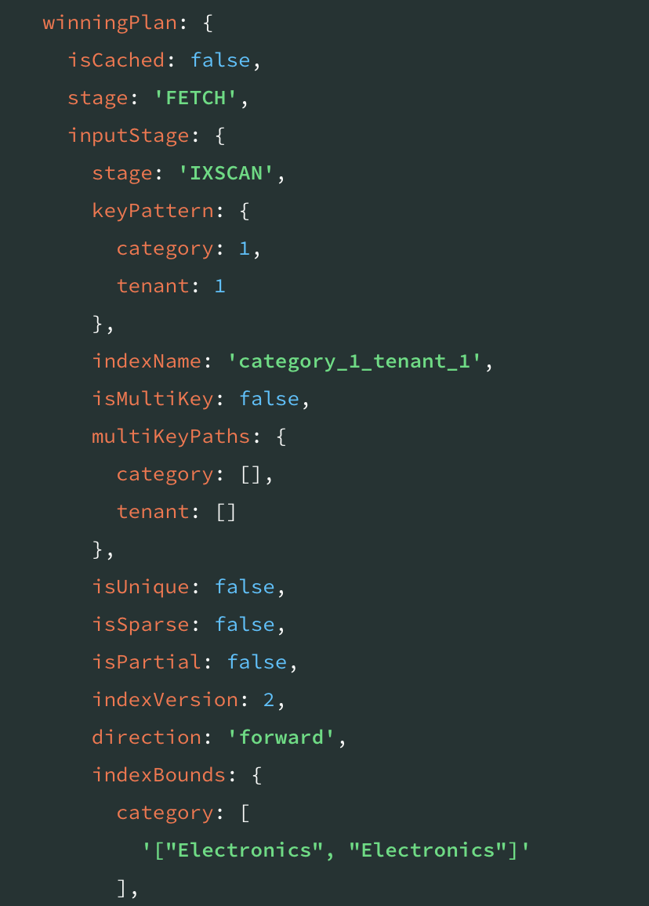
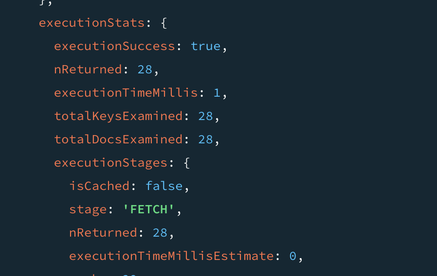
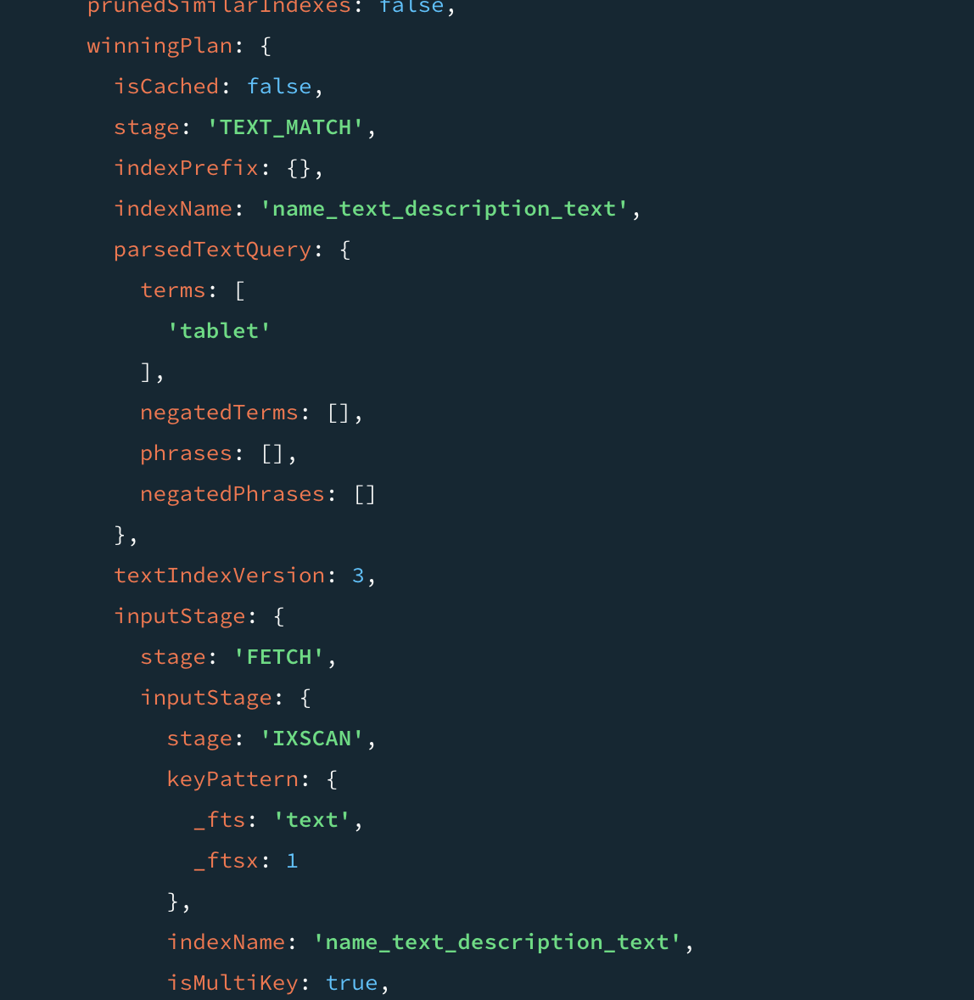
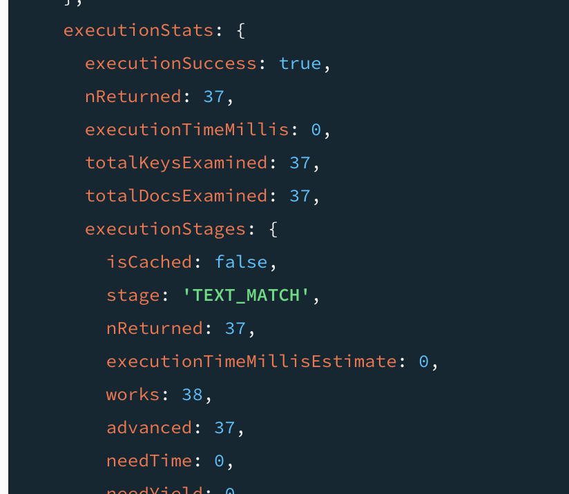

# Product-Peek-App

# Optimized Product Search API & Interface

## Project Overview

Optimized Product Search API & Interface is a full-stack application designed to simulate the powerful search capabilities of a modern e-commerce platform. The system provides users with the ability to search, filter, sort, and explore a wide catalog of products with speed and precision.
The backend, built with Node.js, Express, and MongoDB, prioritizes performance and scalability by implementing optimized indexes, full-text search, and pagination. On the frontend, a React-based interface offers users a clean, intuitive search experience complete with autocomplete suggestions and sorting controls.
This project demonstrates backend-first design thinking and focuses on optimizing system performance under the assumption of large datasets.

## Features

- Search by category, tenant, or keyword (in name/description)
- Autocomplete suggestions for product names
- Full-text search using MongoDB text indexes
- Sort by name or price
- Server-side pagination
- Cross-filtering (category affects tenant list)
- Optimized queries with compound + text indexes

## Tech Stack

**Backend**  
Node.js · Express.js · MongoDB · Mongoose · mongoose-paginate-v2

**Frontend**  
React.js · Axios · HTML/CSS

**Utilities**  
- MongoDB Compass (for data + index validation)
- dotenv for environment variable management

## Setup & Installation

### Prerequisites
- Node.js v18+
- **MongoDB** v8.0+  
  > Make sure MongoDB is installed and running locally at:  
  > `mongodb://localhost:27017`  
  > You can start it using the `mongod` command in your terminal (if installed locally).  
- npm or yarn

### Clone the Repository
```bash
git clone https://github.com/AradhanaRamamoorthy/Product-Peek-App.git
cd Product-Peek-App
```

### Install dependencies
**Backend**
```bash
cd backend
npm install
```

**Frontend**
```bash
cd ../frontend
npm install
```

### Seed the Database

To populate the database with sample product data (**1000+ entries**):

```bash
cd backend
node seed/seed.js
```
The seeded dataset may contain duplicate product names to simulate real-world e-commerce scenarios.
Products are categorized using:
- category (e.g., Electronics, Kitchen)
- tenant (i.e., brand or seller)
  
These fields are used to power the search and filtering functionality.

### Run the App
**Backend**
```bash
cd backend
node app.js
```
The backend server will start at: http://localhost:3000

**Frontend (in a seperate terminal)**
```bash
cd frontend
npm start
```
The frontend app will run at: http://localhost:3001

> **Make sure the backend is running before starting the frontend** to enable full functionality.

## API Documentation

### GET `/api/products/search`

Search products using filters and keyword.

#### Query Parameters

| Parameter   | Type     | Required | Description |
|-------------|----------|----------|-------------|
| `category`  | `string` | No       | Filter by category (e.g., "Electronics") |
| `tenant`    | `string` | No       | Filter by tenant/brand (e.g., "Sony") |
| `keyword`   | `string` | No       | Keyword to search in name or description |
| `sort`      | `string` | No       | Sort order: `price-asc`, `price-desc`, `name-asc`, `name-desc` |
| `page`      | `number` | No       | Page number (default: 1) |
| `limit`     | `number` | No       | Items per page (default: 10) |

#### Example Request

GET /api/products/search?category=Electronics&tenant=Apple&keyword=tablet&sort=price-asc&page=1&limit=5

#### Example Response
```json
{
    "docs": [
        {
            "_id": "6819ac26c51e0448da0e4840",
            "name": "Apple Tablet",
            "category": "Electronics",
            "tenant": "Apple",
            "description": "The Apple Tablet delivers top-tier functionality and cutting-edge design for tech enthusiasts.",
            "price": 301.22,
            "id": "6819ac26c51e0448da0e4840"
        },
        {
            "_id": "6819ac26c51e0448da0e486a",
            "name": "Apple Tablet",
            "category": "Electronics",
            "tenant": "Apple",
            "description": "The Apple Tablet delivers top-tier functionality and cutting-edge design for tech enthusiasts.",
            "price": 331.72,
            "id": "6819ac26c51e0448da0e486a"
        },
        {
            "_id": "6819ac26c51e0448da0e49e0",
            "name": "Apple Tablet",
            "category": "Electronics",
            "tenant": "Apple",
            "description": "The Apple Tablet delivers top-tier functionality and cutting-edge design for tech enthusiasts.",
            "price": 334.41,
            "id": "6819ac26c51e0448da0e49e0"
        },
        {
            "_id": "6819ac26c51e0448da0e4b10",
            "name": "Apple Tablet",
            "category": "Electronics",
            "tenant": "Apple",
            "description": "Compact, efficient, and powerful — the Apple Tablet is perfect for daily use.",
            "price": 1285.36,
            "id": "6819ac26c51e0448da0e4b10"
        }
    ],
    "totalDocs": 6,
    "limit": 4,
    "totalPages": 2,
    "page": 1,
    "pagingCounter": 1,
    "hasPrevPage": false,
    "hasNextPage": true,
    "prevPage": null,
    "nextPage": 2
}
```
> Each product includes both _id (MongoDB ObjectId) and id (string version) due to Mongoose's lean query behavior.

### GET `/api/products/filters`

Fetch all available categories and tenants.

#### Example Response
```json
{
  "categories": ["Home & Kitchen", "Health & Personal Care", "Clothing"],
  "tenants": ["Philips", "Sony", "Nike", "Zara"]
}
```

### GET `/api/products/filtered-filters`

Fetch categories and tenants based on selected filters (cross-filtering).

### Query Parameters

| Parameter | Type     | Description                     |
|-----------|----------|---------------------------------|
| category  | `string` | (Optional) Selected category     |
| tenant    | `string` | (Optional) Selected tenant       |

#### Example Request

GET /api/products/filtered-filters?category=Electronics

#### Example Response
```json
{
    "categories": [
        "Electronics"
    ],
    "tenants": [
        "Apple",
        "Bose",
        "Dell",
        "HP",
        "LG",
        "Lenovo",
        "Samsung",
        "Sony"
    ]
}
```

### GET `/api/products/suggestions`

Autocomplete endpoint for product search.

### Query Parameters

| Parameter | Type     | Required | Description             |
|-----------|----------|----------|-------------------------|
| keyword   | `string` | Yes      | Partial search text     |

#### Example Request

GET /api/products/suggestions?keyword=tablet

#### Example Response
```json
[
    "Samsung Tablet",
    "HP Tablet",
    "Sony Tablet",
    "Apple Tablet",
    "Sony Tablet"
]
```
> Suggestions are limited to the top 5 matches and are case-insensitive.

> #### Additional Notes

- If `sort` is not provided in the `/search` endpoint, results are sorted by `createdAt` in descending order by default.
- If **no filters** (`keyword`, `category`, or `tenant`) are provided to `/search`, the response will be an empty result set:
  ```json
  {
    "docs": [],
    "totalDocs": 0,
    "page": 1,
    "totalPages": 0,
    "hasNextPage": false,
    "hasPrevPage": false
  }
  ```
> The `/suggestions` endpoint performs **partial keyword matching** using **case-insensitive regex** 

## System Architecture

```
Frontend (React.js)
    │
    └──▶ User interacts with SearchBar (category, tenant, keyword, sort)
         │
         └──▶ Sends GET requests via Axios:
                 - /search (main search)
                 - /suggestions (autocomplete)
                 - /filters and /filtered-filters (for dropdowns)
         
Backend (Node.js + Express.js)
    │
    └──▶ Validates inputs (e.g., trim, check sort/page)
         │
         └──▶ Builds MongoDB query:
                 - Text search with $text (if keyword)
                 - Match filters (category, tenant)
                 - Applies sorting & pagination via mongoose-paginate-v2
         │
         └──▶ Sends response to frontend

MongoDB (Database)
    ▲
    └──▶ Optimized with:
             - Text Index (name + description)
             - Compound Index (category + tenant)
             - Lean queries & projection
         ⬅ Returns matched products or suggestion results
```
---

The app uses a **three-layer architecture**:

- **Frontend (React.js)**  
  The user interacts with a React-based UI that includes a search bar, filters, and a results list. It sends requests to the backend using Axios, handles user input changes, and updates the UI dynamically with paginated product data.

- **Backend (Express.js API)**  
  Acts as a bridge between the frontend and the database. It receives and validates query parameters, constructs MongoDB queries (using filters, keyword search, sort, pagination), and sends back optimized, trimmed data. The backend is built using `Express.js` and `mongoose-paginate-v2` for easy pagination.

- **Database (MongoDB)**  
  Stores all product data in a flexible schema. MongoDB is indexed both for full-text search (`name`, `description`) and compound fields (`category`, `tenant`). This ensures quick responses to complex queries.
---

### Data Flow
1. **User Interaction**  
   A user selects filters (category, tenant), enters a keyword, or types into the search input. This triggers a function inside the React `SearchBar` component.
2. **Axios Sends a Request**  
   The frontend sends a `GET` request with relevant query parameters to `/api/products/search`.
3. **Backend Validates and Constructs Query**  
   The backend trims inputs, checks for valid pagination/sorting, then builds a MongoDB query object:
   - Adds a `$text` clause if `keyword` is present.
   - Filters by `category` and/or `tenant` if provided.
   - Applies sorting and pagination options.
4. **MongoDB Executes the Query**  
   MongoDB uses indexes to efficiently search, sort, and limit the results. The use of `lean` queries ensures lightweight objects are returned without extra Mongoose overhead.
5. **Backend Responds to Frontend**  
   The backend sends a structured JSON response with the result `docs`, pagination metadata, and total counts.
6. **Frontend Renders Results**  
   React receives the response and displays products using `ProductList`, along with a pagination control using `Pagination.jsx`.
---

### Architectural Rational

- **Separation of concerns** makes the system easier to test, debug, and scale.
- Backend logic is optimized for **performance**, using `.select` to reduce data size and MongoDB indexes for search-heavy operations.
- The frontend focuses purely on UI/UX, with no business logic, keeping it lightweight and fast.
---

### Database Design & Indexing Strategy

The core of this project’s performance lies in how the **MongoDB database** is structured and optimized. At scale (e.g., thousands or millions of products), it becomes critical that queries remain fast and resource-efficient. Here's how this was achieved:

### Product Schema
The Product schema is lean, purposeful, and optimized for querying
```js
const productSchema = new mongoose.Schema({
  name: String,
  category: String,
  tenant: String,
  description: String,
  price: Number
}, { versionKey: false });
```
- `name`, `description`: Textual fields for search  
- `category`: Product grouping (e.g., Electronics)
- `tenant`: Brand or seller (e.g., Sony)
- `description`: Short marketing blurb
- `price`: Numeric value for sorting and filters

### Database Indexing Strategy

To ensure **scalable, performant search functionality**, we implemented two key indexes in our `Product` schema, chosen specifically to mirror real-world user behavior and optimize the most frequent query patterns.

#### 1. Compound Index on `{ category: 1, tenant: 1 }`

```js
productSchema.index({ category: 1, tenant: 1 });
```

**Why this index?**  
This compound index was strategically chosen to optimize the most common query pattern in the application — filtering products by both `category` and `tenant`. By indexing these fields together, MongoDB can leverage **index intersection and prefix-based matching**, which dramatically improves query performance when users apply multi-faceted filters. This aligns with real-world e-commerce behavior where users often search within specific brands under a particular category (e.g., *"Home & Kitchen" → "Hamilton Beach"*).

It demonstrates thoughtful design that considers:
- **User interaction patterns** (e.g., filtering by brand within a category)
- **Database internals** (leveraging compound index prefix efficiency)
- **Scalability needs** as data volume increases

**Key Benefits**
- Powers the `/search` and `/filtered-filters` endpoints
- Efficiently handles queries like `{ category: "Shoes", tenant: "Puma" }`
- Enables index-bound scans that skip non-matching documents
- Reduces CPU and I/O load under high traffic
- Boosts pagination speed by narrowing the document set before limit/skip
- Reduces latency in dynamic dropdowns (e.g., tenant list changes per category)
---

### Index Verification with `explain()`

The `.explain()` function in MongoDB reveals the **execution plan** for a query — showing whether indexes were used, how many documents were examined, and how efficient the query was.

To ensure our **compound index** on `category` and `tenant` is utilized during filtering, we ran the following query using MongoDB’s `explain("executionStats")` to analyze performance:

```js
db.products.find({ category: "Electronics", tenant: "Apple" }).explain("executionStats");
```

**Index Usage**

MongoDB confirms the use of index:

```json
"stage": "IXSCAN",
"indexName": "category_1_tenant_1",
"keyPattern": { "category": 1, "tenant": 1 },
"indexBounds": {
  "category": ["Electronics", "Electronics"],
  "tenant": ["Apple", "Apple"]
}
```

This confirms that the query uses the `{ category: 1, tenant: 1 }` index rather than scanning the entire collection.

### Index Usage Screenshot



**Execution Stats**

```json
"executionSuccess": true,
"executionTimeMillis": 1,
"totalKeysExamined": 28,
"totalDocsExamined": 28
```

Indicates a fast, index-optimized query that only examined relevant documents.

### Screenshot



### Optimization Insights

The use of the `IXSCAN` stage and minimal document/key examination confirms that our compound index on `category` and `tenant` is highly effective. It allows MongoDB to:

- Avoid full collection scans
- Narrow results early in the query pipeline
- Improve pagination performance
- Maintain low latency even as the dataset grows

This demonstrates our intentional database design for **scalable search performance**.


#### 2. Text Index on `{ name: 'text', description: 'text' }`

```js
productSchema.index({ name: 'text', description: 'text' });
```

**Why this index?**

Users often search using natural keywords like:

/api/products/search?keyword=tablet

This index allows MongoDB to perform full-text search across both `name` and `description` fields using its built-in `$text` operator. It automatically applies tokenization, stemming, and relevance scoring — creating a smarter and more natural search experience.

This design decision reflects an understanding of:
- **User behavior**: Consumers search with partial keywords, not exact strings.
- **Search UX**: Autocomplete + fuzzy matches are expected in modern applications.
- **Database optimization**: Full-text indexes outperform regex-based scans on large datasets.

**Key Benefits**
- Natural language search across product `name` and `description`
- Supports flexible keyword matching, typos, and variations
- Enables relevance-based result ranking
- Powers the `/search` endpoint with `$text: { $search: keyword }`
- Avoids expensive `$regex` queries, boosting performance
---

### Text Index Verification with `explain()`

To ensure our **text index** on `name` and `description` is actively used during keyword searches, we executed the following query with `explain("executionStats")`:

```js
db.products.find({ $text: { $search: "tablet" } }).explain("executionStats");
```

**Index Usage**

MongoDB confirms the use of our index:

```json
"stage": "TEXT_MATCH",
"indexName": "name_text_description_text",
"keyPattern": { "_fts": "text", "_ftsx": 1 }
}
```

This confirms that MongoDB is using text index (on `name` and `description`) to match the term `"tablet"`.

### Index Usage Screenshot



**Execution Stats**

```json
"executionSuccess": true,
"nReturned": 37,
"executionTimeMillis": 0,
"totalKeysExamined": 37,
"totalDocsExamined": 37
```

The query is fully optimized — MongoDB used the `TEXT_MATCH` stage with the correct text index, scanning only relevant documents for fast, accurate results.

### Screenshot



### Optimization Insights

The use of the `TEXT_MATCH` stage along with the correct `name_text_description_text` index confirms that our text index is working exactly as intended. MongoDB:

- Performs relevance-based full-text search across `name` and `description`
- Avoids full collection or regex scans
- Applies tokenization and smart scoring to rank results
- Handles flexible, human-style search input
- Returns results with minimal latency even on large datasets

This validates our decision to leverage MongoDB’s full-text search for a **smarter, scalable product search experience**.

### Pagination Implementation

To ensure fast and efficient browsing of large product datasets, pagination is implemented **both on the backend and frontend**, enabling the user to navigate through results without overloading the client or database.

**Backend: Server-Side Pagination with mongoose-paginate-v2**

Pagination is handled using the `mongoose-paginate-v2` plugin, which enables efficient page-by-page querying.
```js
const options = {
  page: parseInt(page),
  limit: parseInt(limit),
  sort: sortOption,
  lean: true,
  select: 'name category tenant description price'
};
const results = await Product.paginate(query, options);
```

- `page` and `limit` are passed via query parameters
- Supports sorting alongside pagination
- Returns metadata like totalDocs, totalPages, hasNextPage, etc.

The /search endpoint ensures:

- Pagination defaults: `page=1`, `limit=10`
- Validation for invalid values
- Fallbacks to an empty array if no filters are applied

**Frontend: Paginated Display with Controls**

Pagination is driven by state and user interactions:

```js
const [page, setPage] = useState(1);
const [totalPages, setTotalPages] = useState(1);
```

- When the page changes, `fetchProducts` is called with the updated page.
- Results and total pages are updated from the backend response.
- Scrolls to top when new page is loaded.

```js
useEffect(() => {
  if (Object.keys(searchParams).length > 0) {
    fetchProducts({ ...searchParams, page });
  }
}, [page]);
```

**Pagination Component**
```jsx
<Pagination
  page={page}
  totalPages={totalPages}
  onPageChange={setPage}
/>
```

Provides intuitive navigation using Prev/Next buttons and disables them when on first/last page.

### Performance & Optimization

Delivering a fast and resource-efficient product search experience was a central goal of this project. The following strategies were carefully implemented to ensure that the system remains performant and responsive — even as the product catalog scales to thousands of items:

---

#### 1.MongoDB Indexing for Query Speed
*Indexes were crafted to support the most frequent and performance-sensitive query patterns.*

To avoid full collection scans and reduce response times, two key indexes were created:

- **Compound index** on `category` and `tenant` improves the efficiency of filtered searches  
  _(e.g., "Shoes by Nike")_, enabling MongoDB to locate relevant documents rapidly.

- **Text index** on `name` and `description` enables full-text search, allowing users to query with natural language inputs like `"leather bag"` or `"running"` without needing exact matches.

All queries were verified using `.explain()` to confirm that indexes were being properly utilized, ensuring low `executionTimeMillis` and minimal `totalDocsExamined`.

---

#### 2.Lean Queries to Reduce Overhead
*Reducing memory footprint and boosting API speed through smart data handling.*

Search queries use Mongoose’s `.lean()` method to return plain JavaScript objects instead of full Mongoose documents. This minimizes:

- Memory usage on the server  
- CPU cycles for document hydration  
- API response time and payload size

---

#### 3.Server-Side Pagination with `mongoose-paginate-v2`
*Ensures only necessary data is sent per request, avoiding client overload.*

Pagination is handled using the efficient `mongoose-paginate-v2` plugin. This allows:

- Query slicing with `limit` and `skip`  
- Compact metadata responses (e.g., `totalDocs`, `totalPages`, `hasNextPage`)

Only a limited subset of products is returned per request, improving scalability and reducing server load.

---

#### 4.Field-Level Projection

Each query retrieves only the required fields:

```js
select: 'name category tenant description price'
```

This avoids transmitting unnecessary data (e.g., internal metadata, timestamps), leading to:

- Smaller and faster API responses
- Lower network bandwidth usage
- Faster rendering on the frontend

---

#### 5.Controlled Sorting Options
*Sorting is optimized server-side to minimize computation and latency.*

Sorting is handled on the backend using index-friendly fields like price and name, which:

- Keeps logic efficient and scalable
- Prevents performance hits on the client
- Aligns with backend pagination and indexing strategies

---

These optimizations collectively ensure that the application delivers a smooth, scalable, and real-world-ready product search experience — capable of handling thousands of records with minimal latency and efficient resource utilization.

## Scalability Opportunities

This project is designed to be fast and efficient even with thousands of products, but it’s also built with future growth in mind. Here are some thoughtful ways this system could scale further in a real-world scenario:

### 1. Scaling the Database

- **Replication**: Running MongoDB in a replica set would increase resilience and uptime. Even if one node fails, the data remains accessible from other replicas — ideal for production environments.
- **Sharding**: As the product catalog grows, MongoDB’s sharding feature allows horizontal data partitioning across servers (e.g., by `tenant` or `category`), distributing read/write loads and improving throughput.

### 2. Scaling the Backend

- **Horizontal Scaling**: The Express.js server can be deployed across multiple instances behind a load balancer (e.g., AWS ELB), allowing the system to serve more concurrent users with stability.
- **Multi-core Utilization**: Node.js clustering or deploying containers via Kubernetes enables full utilization of server CPU cores, improving parallel request handling.

### 3. Caching for Performance

- **Redis Layer**: Frequently searched queries (e.g., "Nike Shoes") can be cached using Redis to avoid repeated database hits, drastically improving response times and reducing DB load.

### 4. Enhanced Search Capabilities

- **Elasticsearch or MongoDB Atlas Search**: While `$text` indexing covers basic full-text search, a dedicated search engine offers:
  - Fuzzy matching (handles typos and plural forms)
  - Autocomplete and type-ahead features
  - Relevance-based ranking and advanced scoring
  - Faceted filtering (e.g., show filters with product counts)

This transition would upgrade the app to an **e-commerce-grade search experience**.

### 5. Background Processing

- **Job Queues**: Tasks like logging, analytics, or syncing can be offloaded to background workers using libraries like `Bull` (Redis-based) or message brokers like `RabbitMQ`. This keeps the API responsive and avoids blocking the main thread.

### 6. Rate Limiting and Abuse Protection

- **API Throttling**: Middleware like `express-rate-limit` can prevent abuse or excessive load by applying per-IP or per-route request caps — crucial for public-facing APIs or eventual open access.

---

These improvements reflect real-world engineering strategies for building **highly scalable and production-ready search systems**, ready to support millions of users and products.

## Conclusion

This project demonstrates how a well-structured backend, optimized database design, and intuitive frontend can come together to create a responsive, scalable product search system. From intelligent indexing to server-side pagination and performance-focused architecture, each layer was crafted to handle real-world use cases efficiently. Future improvements like advanced caching or external search engines could further enhance performance as the dataset grows.


